# Flutter State Management Wizard 🧙‍♂️

A comprehensive Flutter project demonstrating different state management approaches through an interactive wizard-style interface. This project showcases the evolution from basic StatefulWidget to advanced Provider patterns with shared state synchronization.

## 🙏 Acknowledgments

This project is inspired by and follows the excellent tutorial by **HungriMind**: [Flutter State Management](https://www.hungrimind.com/articles/flutter-state-management). The tutorial provides a clear, step-by-step approach to understanding Flutter's state management evolution, from basic StatefulWidget to advanced patterns. This wizard app serves as an interactive companion to that learning journey.

## 🎯 Project Overview

This application presents 4 different pages, each demonstrating a specific state management approach used in Flutter development. Users can navigate through the pages using Next/Previous buttons while maintaining a synchronized counter value across all approaches.

## 📚 Learning Journey

### Page 1: StatefulWidget Approach
- **Widget Type**: `StatefulWidget`
- **State Management**: Local state with `setState()`
- **Purpose**: Traditional Flutter counter - the foundation
- **Key Concepts**: `_counter` variable, `setState()`, manual state management

### Page 2: CounterModel Approach  
- **Widget Type**: `StatefulWidget` 
- **State Management**: Immutable data class with `copyWith()`
- **Purpose**: Structured state with immutable models
- **Key Concepts**: `CounterModel` class, immutability, `copyWith()` pattern

### Page 3: CounterNotifier Approach
- **Widget Type**: `StatelessWidget` ✨
- **State Management**: `ValueNotifier` + `ValueListenableBuilder`
- **Purpose**: Reactive programming without `setState()`
- **Key Concepts**: `CounterNotifier`, automatic UI updates, reactive patterns

### Page 4: Provider Pattern
- **Widget Type**: `StatelessWidget`
- **State Management**: Custom `Provider` (InheritedWidget)
- **Purpose**: App-wide state sharing without prop drilling
- **Key Concepts**: `InheritedWidget`, `Provider.of(context)`, dependency injection

## 🔄 State Flow Diagrams

### State Management Evolution


### Shared Counter Synchronization

```mermaid
sequenceDiagram
    participant P1 as Page1 (StatefulWidget)
    participant P2 as Page2 (CounterModel)
    participant P3 as Page3 (CounterNotifier)
    participant P4 as Page4 (Provider)
    participant S as Shared CounterNotifier
    
    P1->>S: increment() → Update shared state
    S->>P2: Sync on navigation
    S->>P3: ValueListenableBuilder auto-update
    S->>P4: Provider.of(context) direct access
    
    P4->>S: increment() → Update shared state
    S->>P1: Sync on navigation
    S->>P2: Sync on navigation  
    S->>P3: ValueListenableBuilder auto-update
```


### Widget Architecture


## 🧪 Testing & Development

### VS Code Test & Debug Configuration

Create `.vscode/launch.json` in your project root:

```json
{
    "version": "0.2.0",
    "configurations": [
        {
            "name": "Flutter: Run App",
            "type": "dart",
            "request": "launch",
            "program": "lib/main.dart",
            "flutterMode": "debug"
        },
        {
            "name": "Flutter: Run Tests",
            "type": "dart", 
            "request": "launch",
            "program": "test/widget_test.dart",
            "args": ["--reporter", "json"]
        },
        {
            "name": "Flutter: Run App (Release)",
            "type": "dart",
            "request": "launch", 
            "program": "lib/main.dart",
            "flutterMode": "release"
        }
    ]
}
```

### Running Tests

#### From VS Code:
1. Open the **Test Explorer** panel (View → Test)
2. Click **Run All Tests** or run specific test groups
3. Use **F5** to run the selected launch configuration
4. Use the **Test and Debug** toolbar for quick access

#### From Terminal:
```bash
# Run all tests
flutter test

# Run specific test
flutter test test/widget_test.dart

# Run tests with coverage
flutter test --coverage

# Run specific test by name
flutter test --plain-name "Basic navigation test"

# Run app in debug mode
flutter run

# Run app in release mode  
flutter run --release

# Analyze code quality
flutter analyze
```

### Test Coverage

The project includes comprehensive integration tests covering:
- **Navigation**: Forward/backward wizard navigation
- **Button States**: Previous/Next button enable/disable logic
- **Page Content**: Verification of descriptions and titles
- **Counter Functionality**: Increment operations on each page
- **State Synchronization**: Shared counter across different approaches

## 🚀 Getting Started

### Prerequisites
- Flutter SDK (latest stable version)
- VS Code with Flutter/Dart extensions
- A device/emulator for testing

### Installation
1. Clone this repository
2. Run `flutter pub get` to install dependencies
3. Launch with `flutter run` or use VS Code's debug configuration

### Project Structure
```
lib/
├── main.dart                 # App entry point with Provider setup
├── models/
│   └── counter_model.dart    # CounterModel and CounterNotifier classes
├── pages/
│   ├── page1_stateful.dart   # StatefulWidget approach
│   ├── page2_counter_model.dart  # CounterModel approach  
│   ├── page3_notifier.dart   # CounterNotifier approach
│   └── page4_provider.dart   # Provider pattern approach
└── provider.dart             # Custom Provider (InheritedWidget)

test/
└── widget_test.dart          # Integration tests
```

## 🎨 Features

- **Interactive Wizard Navigation**: Smooth page transitions with Next/Previous buttons
- **Visual Progress Indicators**: Dots showing current page (1-4)
- **Synchronized Counter**: Same value maintained across all state management approaches
- **Educational Content**: Detailed explanations and code comments
- **Responsive Design**: Scrollable content that works on all screen sizes
- **Comprehensive Testing**: Integration tests covering all functionality

## 🔧 Technical Implementation

### Shared State Architecture
The app uses a custom `Provider` (InheritedWidget) at the root level containing a `CounterNotifier` that manages a `CounterModel`. Each page demonstrates a different way to interact with or manage state:

1. **Page 1**: Maintains local state, syncs with shared state on changes
2. **Page 2**: Uses immutable model updates, syncs with shared state
3. **Page 3**: Directly listens to shared notifier via `ValueListenableBuilder`
4. **Page 4**: Directly accesses and modifies shared state via `Provider.of(context)`

### Error Handling
All pages include try-catch blocks to handle cases where the Provider context might not be available (especially useful for testing scenarios).

---

## 📝 Prompts History

i've been learning about state management and following https://www.hungrimind.com/articles/flutter-state-management. I started from initial flutter counter app, and then moving further extending it to use CounterModel then CounterNotifier (see models/counter_model.dart) and finaly Provider.dart. You can see i was commenting out the code switching into new approaches and finaly switching  HomePage from StateFullWidget to StateLessWidget. Based on this i want you to generate the demo app with 4 separate pages presented aka wizard style with  Next>> and << Previous buttons, so every page will be presenting stages of my learning aproach starting from standard flutter init StateFullWidget homepage, the second page will be using CounterModel the next one with CounterNotifier and ValueListenableBuilder and forth page using the Provider class. All pages will be listening to the same counter so i can see same value through the pages. Make comments in the code. 

can you explain why Page3NotifierCounter is still a StatefulWidget, isn't using ValueListenableBuilder should address notifying about counter change?

Update README.md file describing the project and the approach used for every page following by simple mermaid diagram explaining state behaviours. 
The  README.md file contains current and previous prompts. Make any changes to the file but do not change the prompts, simply  put them at the end under prompts history section. create launch-debug test section so i can run it from VS 'Test and Debug' toolbar with explanation, plus terminal command to run test from terminal.